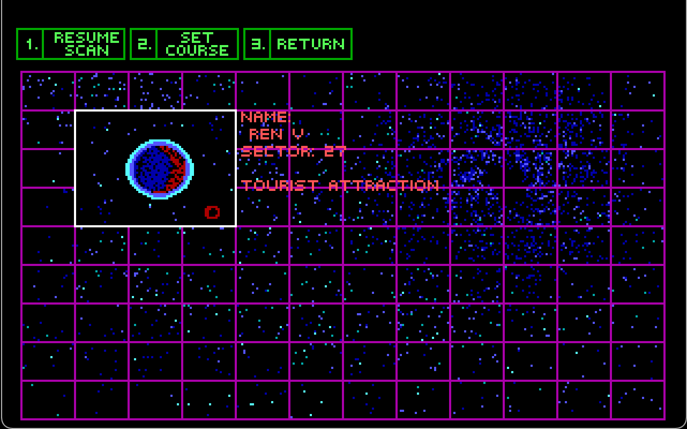

# Space Quest III - The Undiscovered Country Road - Extended Planets Pack!

WARNING: This mod is still in early development and is a work in progress.

## What is this? 

A mod for the DOS version of Space Quest III. It adds new planets to the Aluminum Mallard's scanner. Currently, there are two new planets appearing in sectors 23 and 27. Both planets can be landed on, but are mostly proof of concepts that will change drastically with future updates.

## INSTALLATION

This mod requires the retail version of SQ3. Both the GOG and Steam versions are compatible. This mod has only been tested with SQ3 version 1.018. Savegames are not compatible with vanilla SQ3.

To download the patch, click the green "CODE" button near the top of this page and select "Download Zip". Uncompress the .zip and find the PATCHES folder.

DOSBox users must copy <b>only the contents</b> of PATCHES into the SQ3 game folder. All the mod files need to be loose inside the folder next to SQ3.bat - this makes uninstalling the mod difficult, so it's recommend you back up your SQ3 game folder before installing.

ScummVM users can copy either the contents or the entire PATCHES folder (which makes removing the mod easier) into the SQ3 game folder.

## Why am I getting so many pop-up ads during the game?

The SQ3-TUCR-EPP mod's revenue model is ad-supportd free-to-play. You can pay 20 buckazoids to remove all advertisements from the game by typing "PAY MAGIC". 

Alternately, disable them immediately if you find them too annoying:

 
  
<b>(click here to reveal spoiler)</b>

   Use the command "PAY NOTHING" to disable ads immediately without payment.

## I'd like to purchase in-game advertising.

Please go <a href="https://github.com/Doomlazer/SQ3-TUCR-EPP/issues/1">here</a>.

## I have an idea for a planet.

New planet submissions are engouraged, though limited by HEAP memory in some scripts. I'm not sure what the max number of planets will be. I don't think ScummVM cares about exeeding the HEAP, but DOSBox will crash. The goal is to support both. 

A tutorial covering what is needed to add a new planet is coming, but the source code for scripts in the PATCHES folder can be referenced in the meantime. 

To get started download SCICompanion from https://github.com/Kawa-oneechan/SCICompanion or http://scicompanion.com/download/. Move the 'src' folder and game.ini into a backed up copy of your SQ3 folder, then open resource.map from within SCICompanion. The modified scripts will already be there, but you'll need to import any pics or views from the PATCHES folder.

## I'm trying to test a planet, how can I skip the opening sequence?

When Roger wakes up and exits the escape pod, type <b>PUMP SHARK</b> to activate debugging. 

You can use the debug command <b>TP</b> to teleport to other rooms, but it's best to type <b>QA</b> in the first room, then select the "space" option which makes the Mallard spaceworthy and ready to warp to any planet. 

FYI, the QA debug command is only available in the first room. More debugging info <a href="http://sciwiki.sierrahelp.com//index.php?title=SCI_Debug_Modes#Space_Quest_3">here</a> and <a href="https://github.com/Doomlazer/SCI-Debug-Resources">here</a>.

## What's changed recently?

The new planet in sector 27 is now explorable. It's still missing several features and you will probably not be able to leave yet.

## CREDITS

<b>Sector 23 & 27:</b>

DoomLazer - Concepts and Programming

Threepwang - Background Artist
