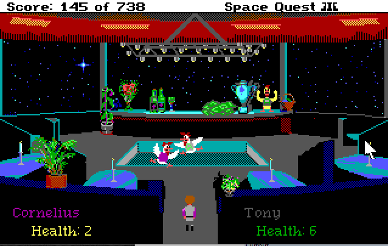

# Space Quest III - The Undiscovered Country Road - Extended Planets Pack!

WARNING: This mod is still in early development.

## What is this? 

A mod for the DOS version of Space Quest III. It adds new planets to the Aluminum Mallard's scanner. Currently, there are two new planets and one new space station. The mod is still in early development and in an unfinished state. Causal players should wait until the final release for the best experience. 

## INSTALLATION

This mod requires the retail version of SQ3. Both the GOG and Steam versions are compatible. This mod has only been tested with SQ3 version 1.018. Savegames are not compatible with vanilla SQ3.

To download the patch, click the green "CODE" button near the top of this page and select "Download Zip". Uncompress the .zip and find the PATCHES folder.

DOSBox users <b>must copy the contents</b> of 'patch' into the SQ3 game folder. All the mod files need to be loose inside the folder next to SQ3.bat - this makes uninstalling the mod difficult, so it's recommend you back up your SQ3 game folder or use a copy of SQ3 for this mod.

ScummVM users can move the entire 'patch' folder into the SQ3 game folder. Remove the folder to uninstall.

## New features

### AstroChicken Fighting

At the newly renamed "Quirk's Bar" location there is a backroom where Holo-fights take place! Players can now place bets on the outcome (room is still incomplete). 

### Decoder Ring

The Monolth Buger Decoder ring is now a fully functional ceasar cipher. Rotating the dial on the ring changes the letter offset on the ring. It also shows the standard english letters on the videogame screen - however scrambled they might be.

### Personal Time Disruptor

This new inventory item can temporarily freeze a copy of Roger in time, this will be used for some future puzzles and can also be used to <a href="https://www.youtube.com/watch?v=czkSgwzEfqA">cheat death</a>. This has not been fully tested against all deaths yet, please report bugs.

## I'm trying to test a planet, how can I skip the opening sequence?

When Roger wakes up and exits the escape pod, type <b>PUMP SHARK</b> to activate debugging. 

You can use the debug command <b>TP</b> to teleport to other rooms, but it's best to type <b>QA</b> in the first room, then select the "space" option which makes the Mallard spaceworthy and ready to warp to any planet. 

FYI, the QA debug command is only available in the first room. More debugging info <a href="http://sciwiki.sierrahelp.com//index.php?title=SCI_Debug_Modes#Space_Quest_3">here</a> and <a href="https://github.com/Doomlazer/SCI-Debug-Resources">here</a>.

## CREDITS

<b>Sectors 23, 27 & 70:</b>

DoomLazer - Concepts and Programming

Threepwang - Backgrounds

## What's changed recently?

### April 2023

Players may now place wagers on the astrochicken fights at Quirk's bar.

A new room was started on Aquavelvetta. The gate requires Roger to be in two places at once to open.

### Febuary 2023

Added partially complete astrochicken fights at Quirk's bar.

Renamed Quark's to Quirk's for legal reasons.

### December 2022 

Monolith Burger Decoder Ring is now a functional Ceasar Cipher.

### October 2022

Dabo working, but rough around the edges. 

Quark's is about 75% complete.

Personal Time Disruptor bug fixes, but still mostly untested.

### July 2022

Planet Ren (sector 27) is mostly done.

Quark's Bar can be visited but it's in very unfinished state.

Fixed a bug where "scanning sector %d" never goes away if the play clicks scan too quickly.

Personal Time Disruptor added.

### May 2022 

Sector27 is now Planet Ren and more than half implemented.

