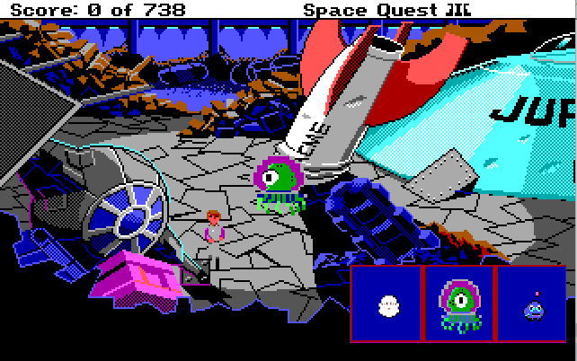
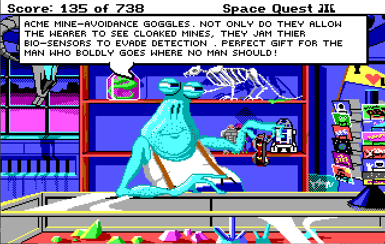
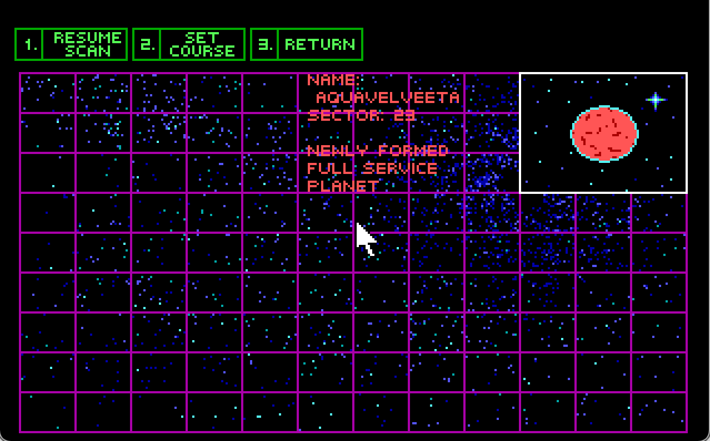

# Space Quest III - The Undiscovered Country Road - Extended Planets Pack!

## What is this? 

A mod for the DOS version of Space Quest III. It add several new planets and features to explore while leaving the base game mostly intact. It is currently under development and unfinished in several places. 

Notice: Due to SCI0 memory limitations this mod is supported in ScummVM only. DOSBox will crash with heap errors. It's unfortunate, but I believe the freedom to implement complex new features outweighs DOSBox compatibility for this project. 

## New features

### Second Arcade Cabinet

Work in Progress: On planet Ren there is a new game that can be played.

### Virtual Pet

Work in Progress: The player starts with a new "Pet" inventory item (for now). Once activated, it follows Roger around and has some very basic AI behaviors.

On initialization you must name the pet. The name can be any word that is not already in the SQ3 vocab (words already recognized by the SCI0 parser are invalid as pet names).

Pet can be activated/deactivated as desired. Typing the pet's name brings up command options such as FOLLOW, STAY and MORPH. 

'Morph' will cycle through the three different pet styles (see insert image above). The inital style is chosen randomly at the start of a new game, so use morph to select your preference.

This is a draft version: Pet art, style variations and commands are likely to change. The pet may show up in inappropriate screens or out of scale until it's been fully debugged. 

### AstroChicken Fighting

At "Quirk's Bar" there is a backroom for Holo-fights. Players can place bets on the outcome, but the room is still feature incomplete. 

### Decoder Ring

The Monolth Buger Decoder ring is now a fully functional ceasar cipher. Rotating the dial on the ring changes the letter offset on the ring. It also shows the standard english letters on the AstroChicken videogame screen - however scrambled they might be.

### Personal Time Disruptor

This new inventory item can temporarily freeze a copy of Roger in time, this will be used for some future puzzles and can also <a href="https://www.youtube.com/watch?v=czkSgwzEfqA">cheat death</a>. This item has not been fully tested against all deaths yet.

### Mine-Avoidance Goggles

Fester now sells an additional item.

### New Planets

Three new locataions are now able to be visited using the aluminum mallard. 

 

## INSTALLATION

This mod requires the retail version of SQ3. Both the GOG and Steam versions are compatible, but SQ3 version 1.018 is required.

Copy the "patch" folder into your SQ3 game folder. Launch using ScummVM as normal.

Remove the "patch" folder to uninstall.

## I'm trying to test some of the new features, how can I skip the opening sequence?

When Roger wakes up and exits the escape pod, type <b>PUMP SHARK</b> to activate debugging. 

You can use the debug command <b>TP</b> to teleport to other rooms, but it's best to type <b>QA</b> in the first room, then select the "space" option which makes the Mallard spaceworthy and ready to warp to any planet. 

FYI, the QA debug command is only available in the first room. More debugging info <a href="http://sciwiki.sierrahelp.com//index.php?title=SCI_Debug_Modes#Space_Quest_3">here</a> and <a href="https://github.com/Doomlazer/SCI-Debug-Resources">here</a>.

## Credits

DoomLazer - Programming

Threepwang - Backgrounds

## Recent Changes

### July 2023

Added draft version of a new arcade cabinet on Ren.

Patch is now ScummVM only due to heap limitations :( 

Added draft version of Virtual Pet.

### May 2023

Added Goggles inventory item.

### April 2023

Players may now place wagers on the astrochicken fights at Quirk's bar.

A new room was started on Aquavelvetta. The gate requires Roger to be in two places at once to open.

Easter Egg <a href="https://www.youtube.com/watch?v=ZASZ0iqXUAc">ending dialogue</a>.

### Febuary 2023

Added partially complete astrochicken fights at Quirk's bar.

Renamed Quark's to Quirk's for legal reasons.

### December 2022 

Monolith Burger Decoder Ring is now a functional Ceasar Cipher.

### October 2022

Dabo working, but rough around the edges. 

Quark's is about 75% complete.

Personal Time Disruptor bug fixes, but still mostly untested.

### July 2022

Planet Ren (sector 27) is mostly done.

Quark's Bar can be visited but it's in very unfinished state.

Fixed a bug where "scanning sector %d" never goes away if the play clicks scan too quickly.

Personal Time Disruptor added.

### May 2022 

Sector27 is now Planet Ren and more than half implemented.

